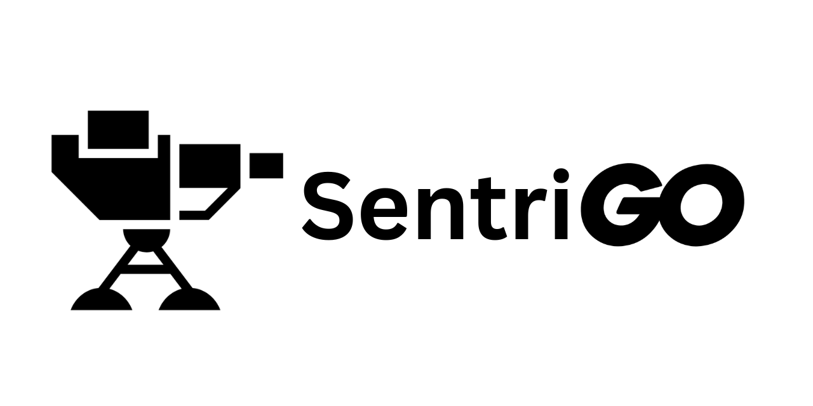

<!-- # SentriGo -->

## Lightweight Intrusion Detection System (IDS) for Windows

🚀 **SentriGo** is a lightweight, real-time packet sniffing tool and Intrusion Detection System (IDS) built using Go and the `gopacket` library.

## 📝 Description

SentriGo listens to a selected network interface and analyzes packets in real-time. It's designed for educational and home-lab usage to understand basic network intrusion detection techniques.

Currently, it includes:

- SYN flood detection
- ICMP flood detection
- NMAP scan detection

## ⚙️ Prerequisites

### 🪟 OS Support:

✅ **Tested on Windows**

✅ **Linux**

### 📥 Requirements:

1. [Go Programming Language](https://golang.org/dl/) (v1.18+)
2. [Npcap](https://npcap.com/#download) (must be installed)

> 📌 **Npcap** is a packet capture driver required to access network interfaces on Windows.
